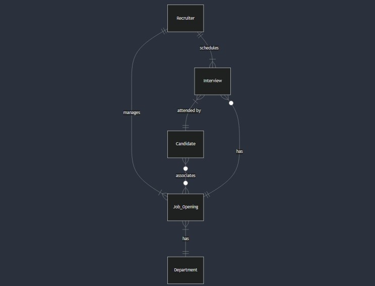

# Design Document

By Noemi Carolina Guerra Montiel

Video overview: <https://youtu.be/npVbJdlIHoQ>

## Scope

My final project for the CS50 SQL course is a database designed for an Applicant Tracking System (ATS) named "RecruitIn". This system streamlines the recruitment process for companies by managing various entities, enabling recruiters to provide candidates with a more efficient and effective follow-up experience. The scope for this database is:

* Recruiters, including the recruiter's basic identifying information
* Candidates, including basic identifying information
* Departments, including basic identifying information
* Job Openings, including basic identifying information, their assigned recruiter, candidates, and department
* Interviews, including the candidate to be interviewed, their assigned recruiter, job opening, and basic information about the details of the interview

Out of scope are elements like offers, assessments, submissions, referrals, and other additional elements.

## Functional Requirements

This database will let users:

* CRUD operations for recruiters, candidates, departments, job openings, and interviews.
* Associate multiple candidates to a job opening and associate multiple interviews to a candidate with their corresponding recruiter.
* Assign an ‘admin’ or ‘standard’ permission on users to prevent users from deleting sensible data. This is possible through the addition of triggers.

Note that this system will not support the addition of a language like Python for the permission triggers.

## Representation

The SQLite database is represented as the following:

### Entities

#### Recruiters

The `recruiters` table includes:

* `id`: 
    - Specifies the unique ID for the recruiter as an `INTEGER`. 
    - This column thus has the `PRIMARY KEY` constraint applied.
* `first_name`: 
    - Specifies the recruiter's first name as `TEXT`, given `TEXT` is appropriate for name fields. 
    - A `NOT NULL` constraint is applied to make sure that the user adds some input.
* `last_name`: 
    - Specifies the recruiter's last name. 
    - `TEXT` is used for the same reason as `first_name`. 
    - A `NOT NULL` constraint is applied to make sure that the user adds some input.
* `username`: 
    - Specifies the recruiter's email or username. 
    - `TEXT` is used because the input is a short string. 
    - A `UNIQUE` constraint is applied because the field should not be repeated to guarantee the accounts integrity.
    - A `NOT NULL` constraint is applied to make sure that the user adds some input. 
* `password`: 
    - Specifies the recruiter's password of their account. 
    - `TEXT` is used because the input is also a short string, however this should also be hashed, since it is a confidential field. 
    - A `NOT NULL` constraint is applied to make sure that the user adds some input.
* `permissions`: 
    - Specifies the user's privileges. 
    - `TEXT` is used for the same reason as `first_name`. 
    - A `CHECK` constraint is added to ensure that the user picks from a list of predetermined options. 
    - A `NOT NULL` constraint is applied to make sure that the user adds some input. 
* `created_time`:
    - Specifies when the user was created. 
    - The timestamp is stored in a `DATETIME` field to ensure that only valid date and time will be stored. 
    - The default value for this attribute is the current timestamp, as denoted by `DEFAULT CURRENT_TIMESTAMP`. 
    - A `NOT NULL` constraint is applied to make sure that the user adds some input. 

#### Candidates

The `candidates` table includes:

* `id`: 
    - Specifies the unique ID for the candidate as an `INTEGER`. 
    - This column thus has the `PRIMARY KEY` constraint applied.
* `first_name`: 
    - Specifies the candidate's first name as `TEXT`, given `TEXT` is appropriate for name fields. 
    - A `NOT NULL` constraint is applied to make sure that the user adds some input.
* `last_name`: 
    - Specifies the candidate's last name. 
    - `TEXT` is used for the same reason as `first_name`. 
    - A `NOT NULL` constraint is applied to make sure that the user adds some input.
* `phone`: 
    - Specifies the candidate's phone number. 
    - `TEXT` is used because, even though we are dealing with a number, the area code could include a '+' sign or it is common practice to input phone numbers with dashes or blank spaces. 
    - A `NOT NULL` constraint is applied to make sure that the user adds some input.
* `email`: 
    - Specifies the recruiter's email address. 
    - `TEXT` is used because the input is a short string. 
    - A `UNIQUE` constraint is applied because the field should not be repeated to guarantee that there are no duplicate candidate entries on our database.
    - A `NOT NULL` constraint is applied to make sure that the user adds some input.
* `linkedin_username`: 
    - Specifies the candidate's LinkedIn account username. 
    - Recruiters like to visit a candidate's LinkedIn profile to get a better understanding of the candidate's experience and qualifications. 
    - `TEXT` is used because the input is a short string. 
* `status`: 
    - Specifies the candidate's application status in a hiring pipeline. 
    - `TEXT` is used because the options are short strings.
    - A `CHECK` constraint is added to ensure that the user picks from a list of predetermined options.
    - There is a `DEFAULT` value set to `new` because all new candidates should start at the top of the funnel.
    - A `NOT NULL` constraint is applied to make sure that the user adds some input. 
* `created_time`:
    - Specifies when the candidate was created. 
    - The timestamp is stored in a `DATETIME` field to ensure that only valid date and time will be stored. 
    - The default value for this attribute is the current timestamp, as denoted by `DEFAULT CURRENT_TIMESTAMP`. 
    - A `NOT NULL` constraint is applied to make sure that the user adds some input. 

#### Departments

The `departments` table includes:

* `id`: 
    - Specifies the unique ID for the department as an `INTEGER`. 
    - This column thus has the `PRIMARY KEY` constraint applied.
* `name`: 
    - Specifies the department's name as `TEXT`, given `TEXT` is appropriate for name fields. 
    - A `NOT NULL` constraint is applied to make sure that the user adds some input.
* `director`: 
    - Specifies the department's director name. 
    - `TEXT` is used for the same reason as `name`. 
    - A `NOT NULL` constraint is applied to make sure that the user adds some input.
* `created_time`:
    - Specifies when the department was created. 
    - The timestamp is stored in a `DATETIME` field to ensure that only valid date and time will be stored. 
    - The default value for this attribute is the current timestamp, as denoted by `DEFAULT CURRENT_TIMESTAMP`. 
    - A `NOT NULL` constraint is applied to make sure that the user adds some input. 

#### Job Openings

The `job_openings` table includes:

* `id`: 
    - Specifies the unique ID for the job opening as an `INTEGER`. 
    - This column thus has the `PRIMARY KEY` constraint applied.
* `department_id`: 
    - Specifies the ID of the department that the job opening has assigned as an `INTEGER`. 
    - This column thus has the `FOREIGN KEY` constraint applied, referencing the `id` column in the `departments` table to ensure data integrity.
* `recruiter_id`: 
    - Specifies the ID of the recruiter that manages the job opening as an `INTEGER`. 
    - This column thus has the `FOREIGN KEY` constraint applied, referencing the `id` column in the `recruiters` table to ensure data integrity.
* `posting_title`: 
    - Specifies the job_opening's posting title as `TEXT`, given `TEXT` is appropriate for name fields. 
    - A `NOT NULL` constraint is applied to make sure that the user adds some input.
* `modality`: 
     - Specifies the job opening format, whether it is required to go to the office, work remotely or a mix of both. 
    - `TEXT` is used because the options are short strings.
    - A `CHECK` constraint is added to ensure that the user picks from a list of predetermined options.
    - A `NOT NULL` constraint is applied to make sure that the user adds some input. 
* `job_description`: 
    - Specifies the job opening's details like position objective, requirements, benefits, etc. 
    - `TEXT` is used because the options are short paragraphs or lists.
* `status`: 
    - Specifies the job opening's status in a more general manner. 
    - `TEXT` is used because the options are short strings.
    - A `CHECK` constraint is added to ensure that the user picks from a list of predetermined options.
    - There is a `DEFAULT` value set to `in-progress` because most new job openings should start by being active and currently on the lookout for recruiting new candidates.
    - A `NOT NULL` constraint is applied to make sure that the user adds some input. 
* `created_time`:
    - Specifies when the department was created. 
    - The timestamp is stored in a `DATETIME` field to ensure that only valid date and time will be stored. 
    - The default value for this attribute is the current timestamp, as denoted by `DEFAULT CURRENT_TIMESTAMP`. 
    - A `NOT NULL` constraint is applied to make sure that the user adds some input. 

#### Interviews

The `interviews` table includes:

* `id`: 
    - Specifies the unique ID for the interview as an `INTEGER`. 
    - This column thus has the `PRIMARY KEY` constraint applied.
* `candidate_id`: 
    - Specifies the ID of the candidate that has been required to attend to an interview as an `INTEGER`. 
    - This column thus has the `FOREIGN KEY` constraint applied, referencing the `id` column in the `candidates` table to ensure data integrity.
* `job_opening_id`: 
    - Specifies the ID of the job opening that been associated to the interview as an `INTEGER`. 
    - This column thus has the `FOREIGN KEY` constraint applied, referencing the `id` column in the `job_openings` table to ensure data integrity.
* `recruiter_id`: 
    - Specifies the ID of the recruiter that has scheduled the interview as an `INTEGER`. 
    - This column thus has the `FOREIGN KEY` constraint applied, referencing the `id` column in the `recruiters` table to ensure data integrity.
* `from`: 
    - Specifies the scheduled start date and time of the interview using the `DATETIME` format.
    - A `NOT NULL` constraint is applied to make sure that the user adds some input.
* `to`: 
    - Specifies the scheduled end date and time of the interview using the `DATETIME` format.
    - A `NOT NULL` constraint is applied to make sure that the user adds some input.
* `modality`: 
     - Specifies the interview's format, whether it is required to go to the office or be taken from anywhere through a videocall. 
    - `TEXT` is used because the options are short strings.
    - A `CHECK` constraint is added to ensure that the user picks from a list of predetermined options.
    - A `NOT NULL` constraint is applied to make sure that the user adds some input. 
* `comments`: 
    - Specifies the interview's details like notes about the candidate. 
    - `TEXT` is used because the input is likely to be a short paragraph.
* `rating`: 
    - Specifies the interview's overall evaluation on a scale ranging from 1 to 5.
    - `INTEGER` is used because the options are all numbers.
* `created_time`:
    - Specifies when the department was created. 
    - The timestamp is stored in a `DATETIME` field to ensure that only valid date and time will be stored. 
    - The default value for this attribute is the current timestamp, as denoted by `DEFAULT CURRENT_TIMESTAMP`. 
    - A `NOT NULL` constraint is applied to make sure that the user adds some input.

#### Others

There are also two additional tables called `associated_candidates` and `current_user`:
* The `associated_candidates` table does not have a unique `PRIMARY KEY` or additional attributes. Its only purpose is to represent the relationship between candidates and job openings. It's `PRIMARY KEY` is a combination of the `FOREIGN KEY` of `candidate_id` referring to the `id` of the `candidates` table and the `FOREIGN KEY` of `job_opening_id` referring to the `id` of the `job_openings` table.
* The `current_user` table is used to simulate an account log-in to make the deletion triggers function correctly. For more information view the [limitations](#limitations) section.

### Relationships

The below entity relationship diagram describes the relationships among the entities in the database.

#### Recruiters - Job Openings Relationship
A recruiter can manage one or more job openings. They must be managing at least one job opening since their role requires active participation in the hiring process. A job opening can only have one recruiter at a time to not cause confusion on which candidates belong to which recruiter.

#### Recruiters - Interviews Relationship
A recruiter can schedule one or more interviews, particularly since each recruiter is responsible for managing multiple job openings, which in turn have many candidates. Each interview is assigned to only one recruiter, who is solely responsible for guiding the candidate through the follow-up and selection process.

#### Interviews - Candidates Relationship
An interview can only be attended by a single candidate, as each candidate should have the opportunity to showcase their skills individually and allow recruiters to evaluate them more thoroughly. However, one candidate can have many interviews since each typically undergoes various interview stages—such as HR, talent acquisition, and technical interviews—to progress through the selection process. 

#### Interviews - Job Openings Relationship
An interview can only be associated with one job opening, as it is focused on a specific position at a time. However, a job opening can have multiple interviews linked to it, whether from various candidates applying for the role or, less commonly, from a single candidate who has progressed through several interview stages.

#### Candidates - Job Openings Relationship
A candidate can be associated to one or more job openings because it could apply to more than one position at the same time to increase his/her chances of success. It is also possible for a candidate to not be associated with any specific job opening, particularly in the initial stages of the hiring process when the recruiting team is still assessing which positions align best with the candidate's skills. Similarly, a job opening can have many candidates associated with it, and having a large pool of applicants is encouraged to ensure the best possible selection. Note that there is a specific table called `associated_candidates` for this relationship.

#### Job Openings - Departments Relationship
A department can be associated with one or more job openings, as multiple vacancies may be available within the same department simultaneously. However, each job opening is assigned to only one department at a time. This schema does not account for individuals working across multiple departments simultaneously.

## Optimizations

The following three indexes where added on the schema to speed common searches:

* Candidate name search:
    - Created to find a candidate's information with their first and last name.
    - Can be also used in combination of the `associated_candidates` table `PRIMARY KEY` to find which job openings are associated to a candidate by their first and last name.
    - Can be also used in combination of the `interviews` table `PRIMARY KEY` to find which interviews are associated to a candidate by their first and last name.
* Job Opening name search:
    - Created to find a job opening's information with their posting title.
    - Can be also used in combination of the `associated_candidates` table `PRIMARY KEY` to find which candidates are associated to a job opening by its posting title.
* Interviews date search:
    - Created to find interviews with a range of schedule dates.

## Limitations

#### Permission triggers
Triggers have been implemented in the database to detect when a user attempts to delete a row from a specified table. This feature was designed to allow only users with `admin` permissions to delete data, particularly from the most crucial tables However, to fully implement this functionality, it is necessary to incorporate a scripting language, such as Python, to establish conditions and identify the currently logged-in user. As discussed in the last lecture on Scaling, unlike MySQL, SQLite lacks built-in functions for effectively assigning different permissions to various user roles. Thus, to simulate a user's log-in, the schema includes a table to store the `current_user` and add a test recruiter with its `user_id` to assign to the trigger. This would need to be improved on a real application.
